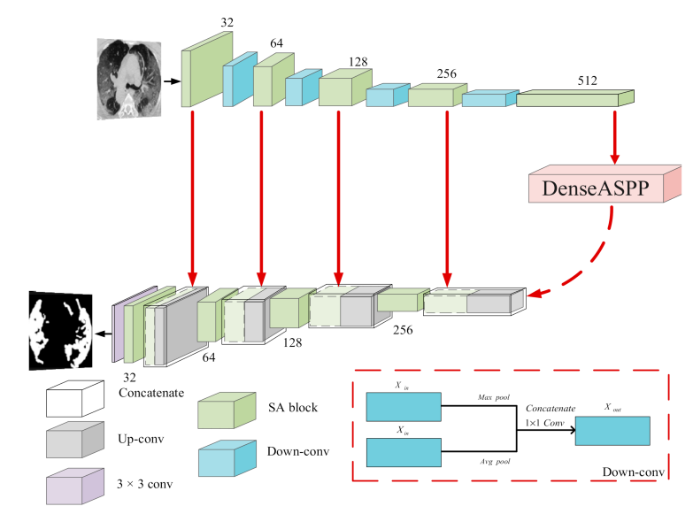
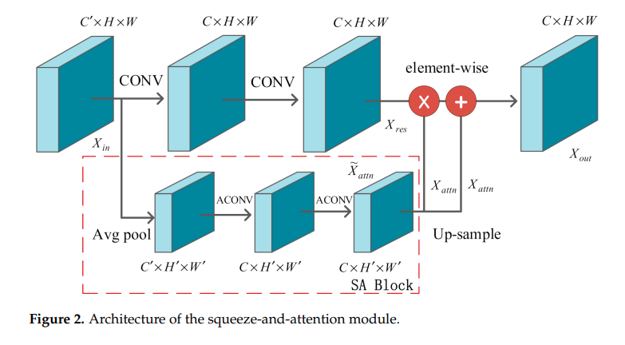
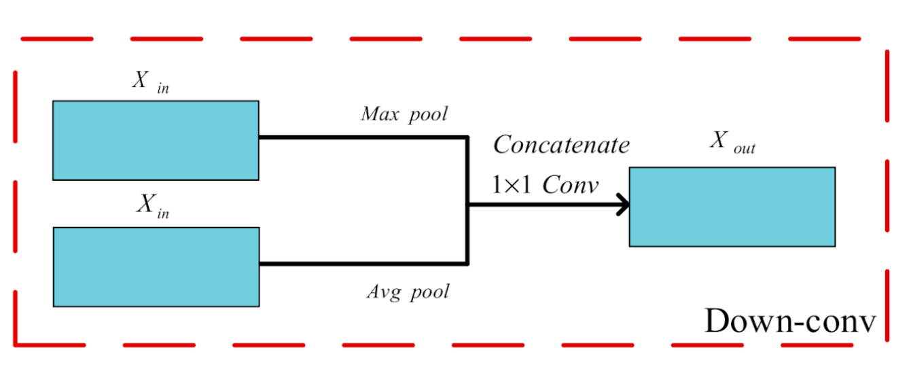
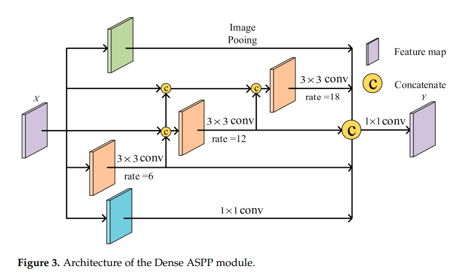

# Visualize-feature-maps
Visualize feature maps in convolutional neural networks.  
I used [SD_UNet](https://www.mdpi.com/2079-9292/11/1/130) model for semantic segmentation task on Oxford Pets dataset.
1. Dataset:  
This dataset has 37 category pet dataset with roughly 200 images for each class. The images have a large variations in scale, pose and lighting. All images have an associated ground truth annotation of breed, head ROI, and pixel level trimap segmentation. 
.  
2. Model:
This model has a encoder and decoder part and in the bottleneck there is DASPP(dense atrous spatial pyramid pooling) module.  

    1. Encoder:  
       In this part we have two blocks, squeeze and attention(SA) block and downsample block.   
          
    2. Bottleneck:
        In this part we have dense atrous spatial pyramid pooling layer (DASPP).  
        
    3. Decoder:
        In this part we have SA blocks and upsample blocks.
After training model on dataset 